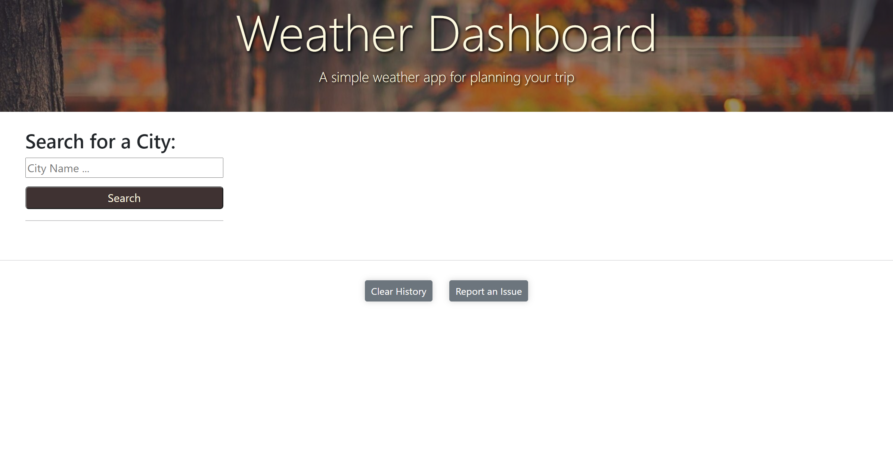
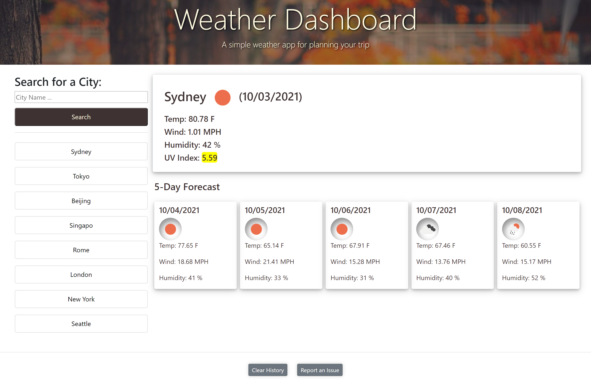

# Weather Dashboard

### Page demo https://sherryzheng2018.github.io/weather-dashboard/
## This weather dashboard application provides current and future weather conditions for people who want to plan ahead before their trips.

* When you put a city name in the search form, you are presented with current and future conditions, and that city is added to the search history.

* In the current city weather condition box, you are presented with city name, the date, an icon representation of weather conditions, the temperature, the humidiy, the wind speed, and the UV index.

* The UV index will have a color that indicates the different levles of UV conditions.

* This weather dashbord also provides you with a 5-day forecast that displays the date, a weather icon , the temperature, the wind speed, and the humidity.

* When you click on a city in the search history, you are again presented with current and future conditions for that city.

### **Please note:**

* This page will store up to 8 cities' searching history (excludes repeated searches), and replaces the newest search history with the oldest one.

* If you want to clear the search history, just simply click the 'Clear History' button on the bottom of the page.

* Per any further questions or issues you are encountered, please click the 'Report an Issue' button.

### Thank you for using this weather dashboard. Enjoy your trip!
- - - 

